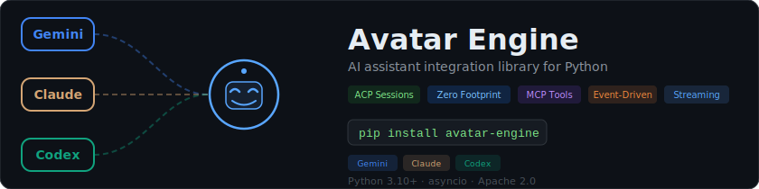
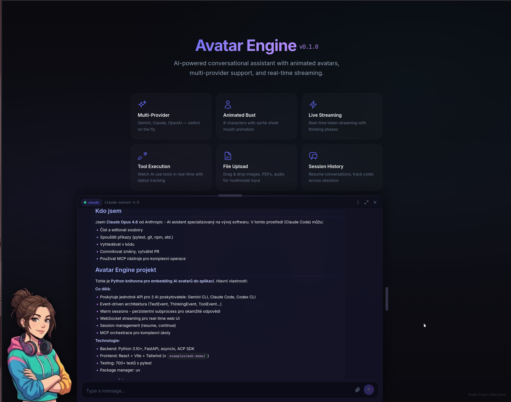
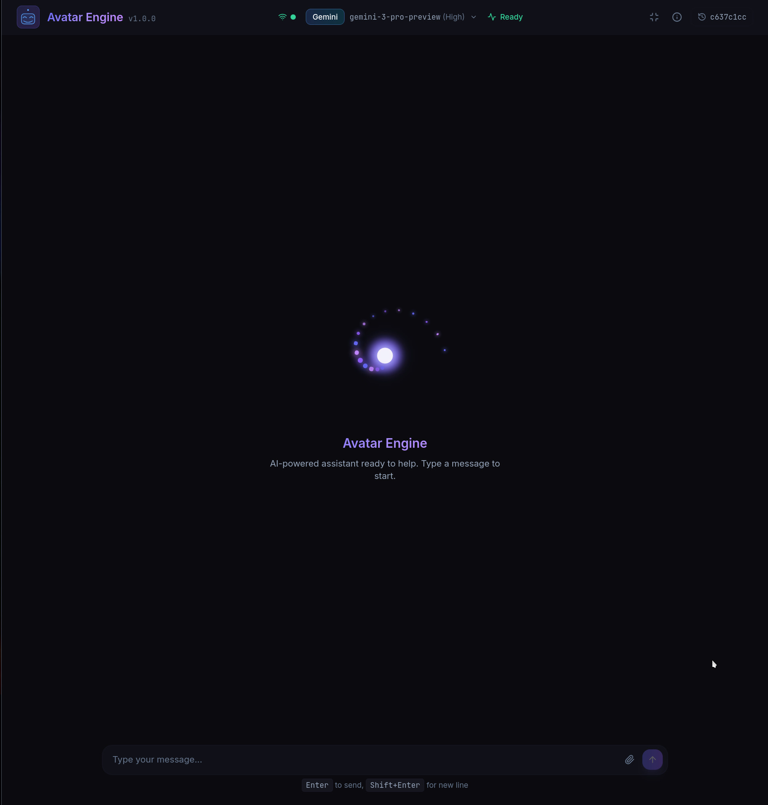

<p align="center">
  <picture>
    <source media="(prefers-color-scheme: dark)" srcset="assets/banner.svg">
    <source media="(prefers-color-scheme: light)" srcset="assets/banner-light.svg">
    
  </picture> 
</p>

<p align="center">
  <strong>Application-specific AI avatar runtime with configurable behavior,<br>context-aware reasoning, and MCP-powered task execution.</strong>
</p>

<p align="center">
  <a href="https://github.com/raven2cz/avatar-engine/actions/workflows/test.yml"></a>
  <a href="LICENSE"></a>
  <a href="https://pypi.org/project/avatar-engine/"></a>
  <a href="https://www.npmjs.com/package/@avatar-engine/core"></a>
  <a href="https://www.npmjs.com/package/@avatar-engine/react"></a>
</p>

<p align="center">
  <a href="https://www.python.org/downloads/"></a>
  <a href="https://nodejs.org/"></a>
  <a href="https://www.typescriptlang.org/"></a>
</p>

---

<p align="center">
  
  
</p>

---

Avatar Engine is designed for embedding a dedicated AI avatar into a specific application domain, not as a generic chatbot wrapper.

- **Application-defined behavior** — Your app controls avatar behavior through explicit configuration (model, prompts, permissions, tool policy, safety limits).
- **Application-provided context** — Your app supplies domain context and source data so the avatar can reason over real project information.
- **MCP for complex operations** — For tasks that are hard to encode as deterministic algorithms, the avatar can call MCP tools to inspect data, run analyses, and assist with larger changes.
- **Provider abstraction as infrastructure** — Gemini CLI, Claude Code, and Codex CLI support is an implementation layer that enables the avatar runtime, not the product goal itself.

## Packages

Avatar Engine is a monorepo with a **Python backend** and **npm frontend packages**:

| Package | Description |
|---------|-------------|
| [`avatar-engine`](https://pypi.org/project/avatar-engine/) | Python backend — AI engine, CLI, web server, provider bridges |
| [`@avatar-engine/core`](packages/core/) | TypeScript — framework-agnostic types, WebSocket protocol, client class |
| [`@avatar-engine/react`](packages/react/) | React — components, hooks, Tailwind preset, CSS styles |

## Features

### Backend (Python)

- **Three Providers** — Gemini CLI, Claude Code, Codex CLI — unified API
- **Warm Sessions** — ACP / stream-json persistent subprocess for instant responses
- **Session Management** — Resume, continue, and list sessions across all providers
- **Event System** — Callbacks for text, tools, thinking, diagnostics, state changes
- **MCP Orchestration** — Tool-based execution with configurable MCP servers
- **Provider Capabilities** — Runtime feature detection (thinking, cost tracking, MCP)
- **Safety System** — Three-mode safety (Safe / Ask / Unrestricted) with ACP permission routing
- **Budget Control** — Pre-request budget enforcement with cost tracking
- **Zero Footprint** — No config files written to your project directory
- **CLI** — Rich terminal interface with thinking spinner, tool panels, session management
- **Web Server** — FastAPI + WebSocket for real-time frontend integration
- **Production Ready** — Rate limiting, metrics, auto-restart, graceful shutdown

### Frontend (TypeScript / React)

- **`AvatarClient`** — Framework-agnostic WebSocket client with auto-reconnect
- **State Machine** — Pure reducer for predictable state management
- **`useAvatarChat`** — React hook for complete chat orchestration
- **23 Components** — Chat UI, provider selector, session panel, avatar bust, safety controls
- **Tailwind Preset** — Dark glassmorphism theme with customizable accent colors
- **CSS Custom Properties** — Runtime theming without rebuilds
- **i18n** — English and Czech translations (extensible)

## Quick Start

### Python Library

```python
from avatar_engine import AvatarEngine

engine = AvatarEngine(provider="gemini")
engine.start_sync()
response = engine.chat_sync("Hello!")
print(response.content)
engine.stop_sync()
```

### CLI

```bash
avatar chat "What is 2+2?"
avatar chat -p claude "Write a haiku"
avatar repl                        # Interactive REPL
avatar health --check-cli          # Check installed providers
avatar session list                # List sessions
```

### React Frontend

```bash
npm install @avatar-engine/react
```

```tsx
import { useAvatarChat, AvatarWidget } from '@avatar-engine/react'
import '@avatar-engine/react/styles.css'

function App() {
  const chat = useAvatarChat('ws://localhost:8420/api/avatar/ws')
  return <AvatarWidget {...chat} />
}
```

### Non-React Frontend (Vue, Svelte, vanilla)

```bash
npm install @avatar-engine/core
```

```ts
import { AvatarClient } from '@avatar-engine/core'

const client = new AvatarClient('ws://localhost:8420/api/avatar/ws', {
  onStateChange: (state) => console.log(state.engineState),
  onMessage: (msg) => {
    if (msg.type === 'text') process.stdout.write(msg.data.text)
  },
})
client.connect()
client.sendChat('Hello!')
```

### Web Demo

```bash
./install.sh --web         # Install dependencies
./scripts/start-web.sh     # Start backend + frontend dev servers
# Open http://localhost:5173
```

## Installation

### Python Backend

```bash
# Interactive installer (recommended)
./install.sh              # Choose providers, optionally install web demo
./install.sh --all        # Install everything

# Or manual with uv
uv sync --extra cli               # Core + CLI
uv sync --extra cli --extra web   # Core + CLI + Web server
```

### Prerequisites

Install only the providers you need. All use **account-based authentication** (Pro/Max subscriptions, no API keys):

```bash
# Gemini CLI (Google account)
sudo npm install -g @google/gemini-cli

# Claude Code (Anthropic Pro / Max)
sudo npm install -g @anthropic-ai/claude-code

# Codex CLI (ChatGPT Plus / Pro)
sudo npm install -g @openai/codex
```

## Architecture

```
avatar-engine/
├── avatar_engine/              # Python backend
│   ├── engine.py               # AvatarEngine — main API
│   ├── bridges/                # Provider implementations
│   │   ├── gemini.py           # Gemini CLI (ACP warm session)
│   │   ├── claude.py           # Claude Code (stream-json)
│   │   └── codex.py            # Codex CLI (ACP via codex-acp)
│   ├── events.py               # Event system
│   ├── web/                    # FastAPI + WebSocket server
│   └── cli/                    # Rich CLI (click)
├── packages/
│   ├── core/                   # @avatar-engine/core (npm)
│   │   └── src/
│   │       ├── types.ts        # TypeScript types (mirrors Python events)
│   │       ├── protocol.ts     # State machine (reducer + parser)
│   │       ├── client.ts       # AvatarClient (WS client)
│   │       └── config/         # Provider & avatar configuration
│   └── react/                  # @avatar-engine/react (npm)
│       └── src/
│           ├── hooks/          # useAvatarChat, useWidgetMode, ...
│           ├── components/     # 23 React components
│           ├── styles/         # Glassmorphism CSS
│           └── tailwind-preset.js
├── examples/
│   └── web-demo/               # Demo app (imports from @avatar-engine/react)
└── tests/                      # 1200+ tests (Python + TypeScript)
```

### Communication Flow

```
Browser (React)                    Python Backend (FastAPI)
┌─────────────────────┐            ┌──────────────────────────┐
│  useAvatarChat       │◄──WS───►  │  /api/avatar/ws          │
│  (or AvatarClient)   │           │    WebSocketBridge        │
│                      │  REST     │      ├─ on(TextEvent)     │
│  Components:         │◄────────► │      ├─ on(ThinkingEvent) │
│  ├─ AvatarWidget     │           │      ├─ on(ToolEvent)     │
│  ├─ ChatPanel        │           │      └─ on(CostEvent)     │
│  ├─ MessageBubble    │           │                           │
│  └─ ...              │           │  AvatarEngine             │
└─────────────────────┘            │    └─ GeminiBridge        │
                                   │    └─ ClaudeBridge        │
                                   │    └─ CodexBridge         │
                                   └──────────────────────────┘
```

## Embedding in Your Application

### Python: FastAPI mount

```python
from avatar_engine.web.server import create_api_app

# Mount avatar API into your existing FastAPI app
avatar_app = create_api_app(provider="gemini")
app.mount("/api/avatar", avatar_app)
```

### Python: Standalone server

```bash
avatar-web --port 8420 --provider gemini
```

### Frontend: Vite proxy

```ts
// vite.config.ts
export default defineConfig({
  server: {
    proxy: {
      '/api/avatar': { target: 'http://localhost:8420', ws: true },
    },
  },
})
```

## Configuration

### YAML Config File

```yaml
provider: "gemini"

gemini:
  model: ""
  approval_mode: "yolo"
  acp_enabled: true
  mcp_servers:
    tools:
      command: "python"
      args: ["mcp_server.py"]

claude:
  model: "claude-sonnet-4-5"
  permission_mode: "acceptEdits"
  cost_control:
    max_turns: 10
    max_budget_usd: 5.0

codex:
  model: ""
  auth_method: "chatgpt"
  approval_mode: "auto"

engine:
  auto_restart: true
  max_restarts: 3
```

### Programmatic Config

```python
engine = AvatarEngine(
    provider="claude",
    model="claude-sonnet-4-5",
    timeout=120,
    system_prompt="You are a helpful assistant.",
    mcp_servers={"tools": {"command": "python", "args": ["server.py"]}},
)
```

## Event-Driven Integration

```python
from avatar_engine import AvatarEngine
from avatar_engine.events import TextEvent, ToolEvent, ThinkingEvent

engine = AvatarEngine(provider="gemini")

@engine.on(TextEvent)
def on_text(event):
    gui.update_speech_bubble(event.text)

@engine.on(ToolEvent)
def on_tool(event):
    gui.show_tool_status(event.tool_name, event.status)

@engine.on(ThinkingEvent)
def on_thinking(event):
    gui.animate_avatar(event.phase.value)

engine.start_sync()
response = engine.chat_sync("Analyze this project")
```

## WebSocket Protocol

Connect to `ws://localhost:8420/api/avatar/ws` for real-time streaming.

**Server → Client:**

| Type | Description |
|------|-------------|
| `connected` | Session info on connect |
| `text` | Text chunk from AI |
| `thinking` | AI thinking phase + subject |
| `tool` | Tool execution status |
| `cost` | Usage/cost update |
| `error` | Error occurred |
| `engine_state` | Engine state change |
| `chat_response` | Complete response |
| `permission_request` | ACP permission request |

**Client → Server:**

| Type | Description |
|------|-------------|
| `chat` | `{"type": "chat", "data": {"message": "..."}}` |
| `stop` | Cancel current request |
| `switch` | Switch provider/model |
| `permission_response` | Respond to permission request |

## REST API

| Method | Endpoint | Description |
|--------|----------|-------------|
| GET | `/api/avatar/health` | Health check |
| GET | `/api/avatar/capabilities` | Provider capabilities |
| GET | `/api/avatar/sessions` | List sessions |
| GET | `/api/avatar/providers` | Available providers |
| POST | `/api/avatar/chat` | Non-streaming chat |
| POST | `/api/avatar/upload` | File upload |

## API Reference

### Python: AvatarEngine

```python
class AvatarEngine:
    # Lifecycle
    async def start() -> None
    async def stop() -> None
    def start_sync() / def stop_sync()

    # Chat
    async def chat(message: str) -> BridgeResponse
    async def chat_stream(message: str) -> AsyncIterator[str]
    def chat_sync(message: str) -> BridgeResponse

    # Sessions
    async def list_sessions() -> list[SessionInfo]
    async def resume_session(session_id: str) -> bool
    session_capabilities: SessionCapabilitiesInfo

    # Events
    def on(event_type) -> Callable  # Decorator
    capabilities: ProviderCapabilities  # Runtime feature flags
```

### TypeScript: AvatarClient

```ts
class AvatarClient {
  connect(): void
  disconnect(): void
  getState(): Readonly<AvatarState>
  sendChat(text: string, attachments?: ChatAttachment[]): void
  stop(): void
  switchProvider(provider: string, model?: string, options?: Record<string, unknown>): void
  resumeSession(sessionId: string): void
  clearHistory(): void
}
```

### React: useAvatarChat

```ts
const {
  messages,           // ChatMessage[]
  sendMessage,        // (text, attachments?) => void
  isStreaming,         // boolean
  connected,          // boolean
  provider,           // string
  model,              // string | null
  thinking,           // { active, phase, subject }
  cost,               // { totalCostUsd, totalInputTokens, totalOutputTokens }
  switchProvider,      // (provider, model?, options?) => void
  permissionRequest,   // PermissionRequest | null
  error,              // string | null
} = useAvatarChat(wsUrl, options?)
```

## Testing

```bash
# Python tests (1036 tests)
uv run pytest tests/ -x -q --timeout=30

# TypeScript tests (204 tests)
npm test -w packages/core
npm test -w examples/web-demo

# Integration tests (with real providers)
uv run pytest tests/integration/ -m gemini -v
uv run pytest tests/integration/ -m claude -v
uv run pytest tests/integration/ -m codex -v

# Lint
uv run ruff check avatar_engine/
```

## License

Apache License 2.0 — see [LICENSE](LICENSE).

## Legal Notice

This project is a **wrapper** that communicates with external AI CLI tools via their documented interfaces. It does not include or redistribute code from these tools.

**User Responsibilities:**
- Install external tools separately (`gemini`, `claude`, `codex-acp`)
- Accept terms of service for each provider
- Authenticate with your account (Google / Anthropic / OpenAI-ChatGPT)

**External Tools:**
- [Gemini CLI](https://github.com/google-gemini/gemini-cli) — Apache 2.0
- [Claude Code](https://github.com/anthropics/claude-code) — Anthropic Terms
- [Codex CLI](https://github.com/openai/codex) — Apache 2.0
- [codex-acp](https://github.com/nicolo-ribaudo/codex-acp) — ACP wrapper for Codex
- [ACP SDK](https://github.com/agentclientprotocol/python-sdk) — Apache 2.0

## Author

[@raven2cz](https://github.com/raven2cz)
